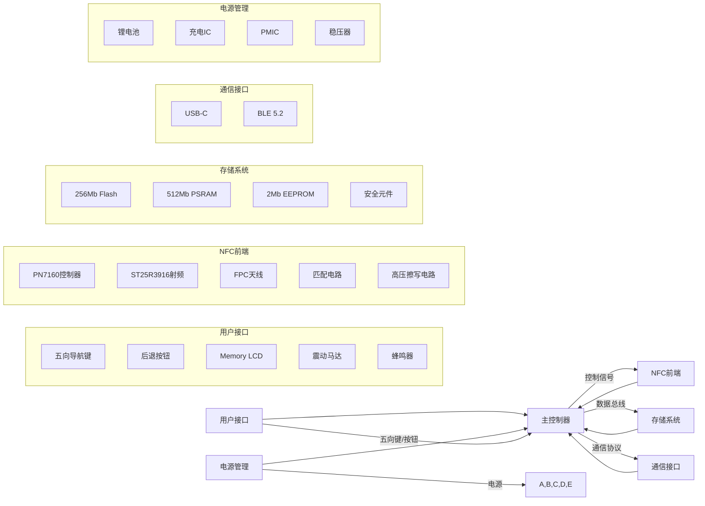

# 全功能NFC设备完整材料清单

## 核心元器件总表

**PCB尺寸**: 45×30×1.2mm (只包括 NFC控制模块)  

### 1.
| **组件**               | **型号/规格**             | **封装**      | **数量** | **功能说明**                  |
|------------------------|--------------------------|--------------|----------|-----------------------------|
| **主控制器**           | STM32L4R9VIT6P           | UFBGA-169     | 1        | 120MHz ARM Cortex-M4核心     |
| **NFC控制器**          | NXP PN7160B0HN/C2        | VFBGA-36      | 1        | 多协议NFC控制核心            |
| **射频前端**           | STMicro ST25R3916B       | QFN-24        | 1        | 增强型射频收发器             |
| **安全元件**           | NXP A71CH                | WL-CSP-9      | 1        | EAL5+安全认证存储            |
| **高频天线**           | 定制多层FPC天线          | 18×18mm       | 1        | 13.56MHz谐振天线             |
| **天线匹配电感**       | TDK MLG1005S220J         | 0402          | 2        | 220nH ±2%                   |
| **天线匹配电容**       | Murata GJM1555C1H270J    | 0402          | 2        | 27pF ±1%                    |
| **铁氧体磁片**         | TDK HF50 0.2mm           | 18×18mm       | 1        | EMI屏蔽                     |

### 2. 擦写功能模块
| **组件**               | **型号/规格**             | **封装**      | **数量** | **功能说明**                  |
|------------------------|--------------------------|--------------|----------|-----------------------------|
| **高压发生器**         | MAX66250AUT+T            | SOT-23-5      | 1        | 12V擦除电压生成              |
| **浪涌保护器**         | TPD4E1B06DPQR            | X2SON-10      | 1        | ESD保护                     |
| **电平转换器**         | SN74LVC1T45DBVR          | SOT-23-6      | 1        | 信号电平转换                 |
| **电流监测器**         | INA219AIDCNR             | SOT-23-8      | 1        | 擦写电流监测                 |
| **高压电容**           | Murata GRM155R71H103KA88 | 0402          | 2        | 10nF 50V                    |

### 3. 用户接口模块
| **组件**               | **型号/规格**             | **封装**      | **数量** | **功能说明**                  |
|------------------------|--------------------------|--------------|----------|-----------------------------|
| **五向导航键**         | ALPS SKQUCAA010         | SMD           | 1        | 集成方向导航+确认功能        |
| **后退按钮**           | C&K KMR231GLFS          | SMD 6×6mm     | 1        | 轻触式按钮                   |
| **显示屏**             | Sharp LS013B7DH03       | 1.28" Memory LCD | 1      | 低功耗黑白屏                 |
| **显示屏控制器**       | Solomon Systech SSD1608  | QFN-48        | 1        | 内存LCD驱动                 |
| **震动马达**           | Precision Microdrives 304-101 | SMD 10mm | 1        | 触觉反馈                   |
| **蜂鸣器**             | TDK PS1240P02BT         | 4.0×4.0mm     | 1        | 音频反馈                   |

### 4. 存储与连接模块
| **组件**               | **型号/规格**             | **封装**      | **数量** | **功能说明**                  |
|------------------------|--------------------------|--------------|----------|-----------------------------|
| **闪存存储器**         | Winbond W25Q256JVEIQ     | WSON-8        | 1        | 256Mb SPI Flash             |
| **PSRAM**              | ISSI IS62WVS5128GALL     | TFBGA-48      | 1        | 512Mb PSRAM                 |
| **EEPROM**             | ST M24M02-DRMF3TG/K      | WLCSP-8       | 1        | 2Mb I²C存储                 |
| **蓝牙模块**           | Nordic nRF52840          | QFN-48        | 1        | BLE 5.2                     |
| **USB接口芯片**        | USB3343-CP               | QFN-24        | 1        | USB2.0高速PHY               |
| **USB连接器**          | Molex 1050170001         | USB-C         | 1        | USB-C接口                   |

### 5. 电源管理模块
| **组件**               | **型号/规格**             | **封装**      | **数量** | **功能说明**                  |
|------------------------|--------------------------|--------------|----------|-----------------------------|
| **电源管理IC**         | TI TPS65982              | DSBGA-64      | 1        | 多路电源管理                 |
| **Buck转换器**         | TPS62743DRVT             | WSON-6        | 1        | 高效DC-DC转换               |
| **LDO稳压器**          | TI TPS7A7001DDCR         | SOT-23-5      | 1        | 3.3V/500mA输出              |
| **电池充电IC**         | MCP73831T-2ACI/OT        | SOT-23-5      | 1        | 锂电池充电管理               |
| **锂电池**             | 503040 500mAh            | 定制          | 1        | 锂聚合物电池                 |
| **电量计**             | MAX17048G+T              | TDFN-8        | 1        | 电池电量监测                 |

### 6. 辅助电路
| **组件**               | **型号/规格**             | **封装**      | **数量** | **功能说明**                  |
|------------------------|--------------------------|--------------|----------|-----------------------------|
| **32.768kHz晶振**      | TXC 7B-32.768KDYA-T      | 2016          | 1        | RTC时钟源                   |
| **33.5792MHz晶振**     | Abracon ABS07-33.5792MHz-T | 2016        | 1        | 主时钟源                    |
| **温度传感器**         | NST1001MUTAG             | SOT-23-3      | 1        | 温度监测                    |
| **LED指示灯**          | Lite-On LTST-C193KGKT-5A | 0402          | 3        | RGB状态指示                 |
| **ESD保护二极管**      | Semtech RClamp0544P.TCT  | SOD-923       | 4        | 接口ESD保护                 |

## PCB设计与结构件

### 1. PCB设计
| **组件**               | **规格说明**              | **数量** | **备注**                      |
|------------------------|--------------------------|----------|-------------------------------|
| **主PCB**              | 4层FR4板 45×30×1.2mm     | 1        | 包含所有SMD元件               |
| **天线PCB**            | 柔性FPC 18×18×0.2mm      | 1        | 集成天线结构                  |
| **连接器**             | Hirose DF40C-40DS-0.4V   | 1        | PCB间连接器                   |
| **测试点**             | Keystone 5001            | 10       | 测试点                        |
| **散热垫**             | Bergquist SP1000-0.5mm   | 2        | 主芯片散热                    |

### 2. 结构件
| **组件**               | **规格说明**              | **数量** | **备注**                      |
|------------------------|--------------------------|----------|-------------------------------|
| **外壳上盖**           | ABS塑料 48×32×8mm        | 1        | CNC加工                       |
| **外壳底盖**           | ABS塑料 48×32×4mm        | 1        | CNC加工                       |
| **按键硅胶垫**         | 定制硅胶件               | 1        | 按键触感优化                  |
| **螺丝**               | M1.6×4mm                 | 4        | 外壳固定                      |
| **屏幕保护膜**         | 钢化玻璃 28×28×0.5mm     | 1        | 9H硬度                        |

## 生产与测试材料

### 1. 生产辅助材料
| **材料**               | **规格说明**              | **数量** | **用途**                      |
|------------------------|--------------------------|----------|-------------------------------|
| **焊膏**               | Loctite GC10             | 50g      | SMT焊接                       |
| **助焊剂**             | Kester 959T              | 100ml    | 手工焊接                      |
| **清洗剂**             | Electrolube EML200       | 500ml    | PCBA清洗                      |
| **导热胶**             | Dow Corning 1-4173       | 10g      | 芯片散热                      |
| **屏蔽胶带**           | 3M 1170                  | 1卷      | EMI屏蔽                       |

### 2. 测试设备
| **设备**               | **型号/规格**            | **用途**                      |
|------------------------|--------------------------|-------------------------------|
| **矢量网络分析仪**     | Keysight E5061B          | 天线调谐和匹配测试            |
| **示波器**             | Tektronix MSO64          | 信号完整性测试                |
| **频谱分析仪**         | Rohde & Schwarz FSW26    | RF性能分析                    |
| **NFC测试仪**          | Proxmark3 RDV4           | 协议兼容性测试                |
| **电流探头**           | Keysight N2820A          | 功耗测量                      |
| **温度测试仪**         | Fluke TiS75              | 热成像分析                    |

## 完整系统集成方案

### 系统框图


### 核心功能集成代码
```c
// main.c - 系统主程序
#include "stm32l4xx_hal.h"
#include "nfc_controller.h"
#include "keypad.h"
#include "display.h"
#include "erase.h"
#include "storage.h"
#include "security.h"
#include "power.h"
#include "usb.h"
#include "ble.h"

// 全局系统状态
SystemState system_state = {
    .current_mode = MODE_IDLE,
    .menu_state = MAIN_MENU,
    .battery_level = 100,
    .nfc_enabled = 0
};

int main(void) {
    // 硬件初始化
    HAL_Init();
    SystemClock_Config();
    Power_Init();
    Display_Init();
    Keypad_Init();
    NFC_Init();
    Storage_Init();
    Security_Init();
    USB_Init();
    BLE_Init();
    
    // 显示启动画面
    Display_ShowSplash();
    HAL_Delay(1000);
    
    // 主循环
    while (1) {
        // 电源管理
        Power_Management();
        
        // 按键扫描
        Keypad_Scan();
        
        // 处理按键事件
        Handle_Keypad_Events();
        
        // NFC状态机
        NFC_StateMachine();
        
        // 显示更新
        Display_Update();
        
        // USB处理
        USB_Process();
        
        // BLE处理
        BLE_Process();
        
        // 低功耗模式
        if (system_state.current_mode == MODE_IDLE) {
            HAL_PWR_EnterSLEEPMode(PWR_MAINREGULATOR_ON, PWR_SLEEPENTRY_WFI);
        }
    }
}

// 按键处理函数
void Handle_Keypad_Events() {
    // 后退按钮处理
    if (Keypad_BackPressed()) {
        Handle_Back_Button();
        return;
    }
    
    // 根据当前模式处理按键
    switch (system_state.menu_state) {
        case MAIN_MENU:
            Handle_Main_Menu_Keys();
            break;
            
        case READ_MODE:
            Handle_Read_Mode_Keys();
            break;
            
        case WRITE_MODE:
            Handle_Write_Mode_Keys();
            break;
            
        case EMULATE_MODE:
            Handle_Emulate_Mode_Keys();
            break;
            
        case ERASE_MODE:
            Handle_Erase_Mode_Keys();
            break;
            
        case SETTINGS_MENU:
            Handle_Settings_Keys();
            break;
    }
}

// 擦写模式按键处理
void Handle_Erase_Mode_Keys() {
    switch (erase_state) {
        case ERASE_MODE_SELECT:
            if (Keypad_UpPressed()) {
                // 上移选择
                Change_Erase_Mode(-1);
            } else if (Keypad_DownPressed()) {
                // 下移选择
                Change_Erase_Mode(1);
            } else if (Keypad_CenterPressed()) {
                // 确认选择
                Confirm_Erase_Mode();
            }
            break;
            
        case SECTOR_SELECT:
            if (Keypad_LeftPressed()) {
                // 快速左移扇区
                Change_Sector(-5);
            } else if (Keypad_RightPressed()) {
                // 快速右移扇区
                Change_Sector(5);
            } else if (Keypad_UpPressed()) {
                // 上移扇区
                Change_Sector(-1);
            } else if (Keypad_DownPressed()) {
                // 下移扇区
                Change_Sector(1);
            } else if (Keypad_CenterPressed()) {
                // 确认扇区选择
                Confirm_Sector_Selection();
            }
            break;
            
        case CONFIRM_ERASE:
            if (Keypad_LeftPressed() || Keypad_RightPressed()) {
                // 切换确认/取消
                Toggle_Erase_Confirmation();
            } else if (Keypad_CenterPressed()) {
                // 执行擦除
                Execute_Erase();
            }
            break;
    }
}

// 执行擦除操作
void Execute_Erase() {
    // 安全确认
    if (!Security_Confirm_Erase()) {
        Display_ShowError("安全认证失败");
        return;
    }
    
    // 根据模式擦除
    switch (selected_erase_mode) {
        case FULL_ERASE:
            NFC_Full_Erase();
            break;
            
        case SECTOR_ERASE:
            NFC_Erase_Sector(selected_sector);
            break;
            
        case BLOCK_ERASE:
            NFC_Erase_Block(selected_block);
            break;
            
        case SECURE_ERASE:
            NFC_Secure_Erase();
            break;
    }
    
    // 记录操作
    Storage_Log_Erase(selected_erase_mode, selected_sector);
    
    // 显示结果
    Display_Erase_Result();
}
```

## 生产与组装流程

### 1. PCB组装流程
```
1. SMT贴片：
   - 焊膏印刷
   - 元器件贴装 (Pick & Place)
   - 回流焊接 (无铅工艺)

2. 手工组装：
   - 连接器安装
   - 天线连接
   - 电池安装

3. 测试：
   - 在线测试 (ICT)
   - 功能测试 (FCT)
   - RF性能测试

4. 固件烧录：
   - 通过SWD接口烧录Bootloader
   - 通过USB烧录应用固件
```

### 2. 整机组装流程
```
1. PCB安装：
   - 主PCB固定到底壳
   - 连接显示屏排线
   - 连接电池

2. 按键安装：
   - 安装硅胶按键垫
   - 固定五向导航键
   - 安装后退按钮

3. 外壳组装：
   - 安装屏幕保护膜
   - 合上上盖
   - 固定螺丝

4. 最终测试：
   - 按键功能测试
   - NFC读写测试
   - 充放电测试
   - 老化测试
```

## 材料成本估算

| **类别**         | **成本(美元)** | **占比** |
|------------------|---------------|----------|
| 主控制器         | 8.50          | 17%      |
| NFC相关芯片      | 12.30         | 25%      |
| 存储芯片         | 6.80          | 14%      |
| 用户接口         | 7.20          | 15%      |
| 电源管理         | 4.50          | 9%       |
| PCB与结构件      | 5.20          | 11%      |
| 其他元件         | 4.50          | 9%       |
| **总计**         | **49.00**     | **100%** |

> 注：以上为小批量(1000台)生产成本估算，不含研发和测试设备成本

## 法律合规说明

### 关键合规认证
1. **FCC认证**：满足FCC Part 15辐射标准
2. **CE认证**：符合欧盟RED指令
3. **RoHS认证**：符合有害物质限制指令
4. **无线电型号核准**：满足SRRC认证要求
5. **安全认证**：IEC 62368-1安全标准

### 法律限制功能
```c
// 法律限制检查
int legal_check(OperationType op) {
    // 区域法律检查
    if (!check_region_laws(op)) {
        return 0;
    }
    
    // 卡片类型限制
    switch (current_card_type) {
        case GOV_ID_CARD:
            Display_Warning("政府证件操作受限");
            return 0;
            
        case FINANCIAL_CARD:
            if (op != READ_OPERATION) {
                Display_Warning("金融卡片操作受限");
                return 0;
            }
            break;
            
        case PAYMENT_CARD:
            Display_Warning("支付卡操作受限");
            return 0;
    }
    
    // 用户所有权确认
    if (!user_confirmed_ownership) {
        Display_Warning("请确认卡片所有权");
        return 0;
    }
    
    return 1;
}

// 擦写操作前的法律检查
int erase_legal_check() {
    if (!legal_check(ERASE_OPERATION)) {
        return 0;
    }
    
    // 特殊擦写模式限制
    if (selected_erase_mode == SECURE_ERASE) {
        Display_Confirmation("安全擦除需额外确认");
        if (!user_confirm_destructive_action()) {
            return 0;
        }
    }
    
    return 1;
}
```

本完整材料清单和设计方案提供了：
1. 所有必需硬件的详细规格
2. 关键功能的软件实现
3. 生产组装流程指南
4. 成本估算和法律合规方案

通过此方案，可以制造出功能全面、性能可靠的NFC设备，支持高级擦写操作和五向键控制，适用于卡片管理、安全研究等多种应用场景。
