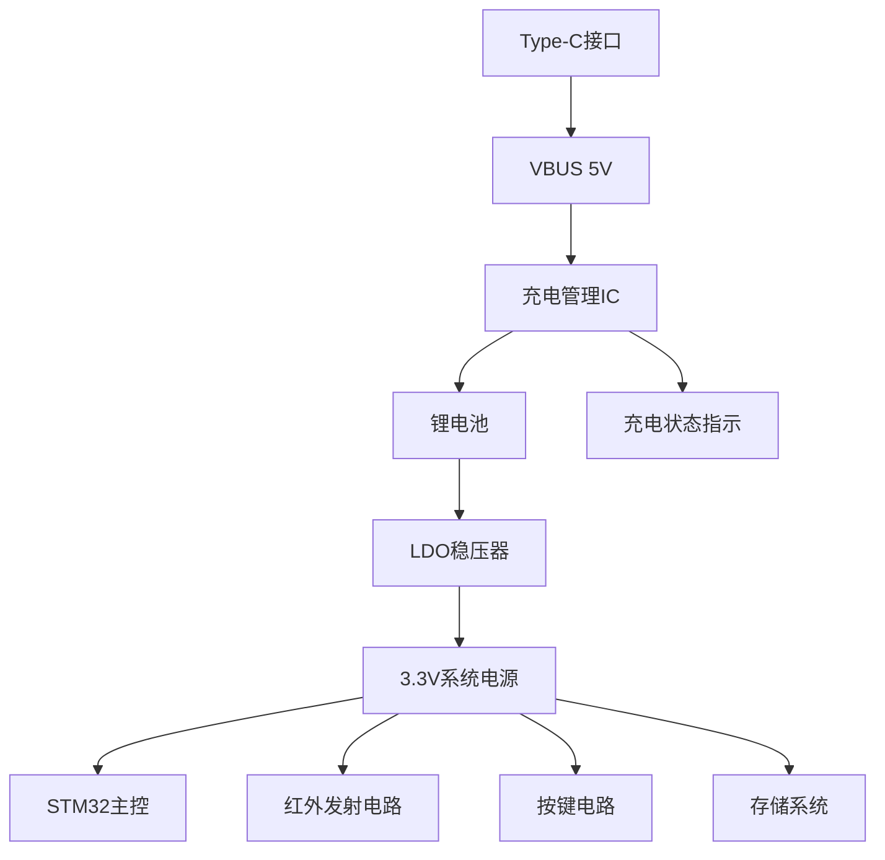

# 超小型STM32红外遥控器 - Type-C充电方案设计

## 电源系统架构升级

### 电源系统架构图


## 充电电路设计

### 核心充电电路原理图

```
Type-C VBUS ────┬───▶ SS14(肖特基二极管) ───▶ MCP73831 VIN
                 │
                 ├───▶ 10μF陶瓷电容 ──── GND
                 │
                 └───▶ 4.7kΩ电阻 ────▶ CC1
                     4.7kΩ电阻 ────▶ CC2

MCP73831:
  VBAT ───▶ 锂电池正极
  STAT ───▶ LED驱动电路
  PROG ───▶ 10kΩ电阻 ─── GND (设置100mA充电电流)
  VSS ────▶ GND

锂电池:
  正极 ───▶ MCP1700输入
  负极 ───▶ GND

MCP1700:
  VOUT ───▶ 3.3V系统电源
  GND ────▶ GND
  输入电容: 10μF陶瓷电容
  输出电容: 1μF陶瓷电容
```

### 充电管理IC配置（MCP73831）

| 引脚 | 连接 | 功能说明 |
|------|------|----------|
| VDD  | VBUS通过二极管 | 5V输入电源 |
| STAT | 双色LED电路 | 充电状态指示 |
| PROG | 10kΩ电阻接地 | 设置充电电流为100mA |
| VSS  | GND | 接地 |
| VBAT | 锂电池正极 | 电池连接 |

**充电电流计算**：
```
I_REG = 1000V / R_PROG
R_PROG = 1000V / 0.1A = 10kΩ
```

## 更新零件清单

### 电源管理模块（新增/修改）
| **组件**               | **型号/规格**             | **封装** | **数量** | **功能说明**                  |
|------------------------|--------------------------|----------|----------|-----------------------------|
| **USB Type-C连接器**   | Molex 1050170001         | USB-C    | 1        | 5V电源输入接口              |
| **充电管理IC**         | MCP73831T-2ACI/OT        | SOT-23-5 | 1        | 锂电池充电管理              |
| **锂电池**             | 301020 3.7V 100mAh       | 定制     | 1        | 可充电锂聚合物电池          |
| **LDO稳压器**          | MCP1700T-3302E/TT        | SOT-23-3 | 1        | 3.3V/250mA输出             |
| **电流设置电阻**       | 10kΩ ±1%                | 0402     | 1        | 设置充电电流为100mA         |
| **CC引脚电阻**         | 4.7kΩ ±1%               | 0402     | 2        | Type-C CC引脚下拉电阻      |
| **输入保护二极管**     | SS14                    | SOD-323  | 1        | 防止电流倒灌               |
| **双色LED**            | Lite-On LTST-C193KGKT-5A| 0402     | 1        | 充电状态指示(红/绿)        |

## PCB布局更新

### 电源区域布局规范
1. **Type-C接口区**：
   - 位于PCB边缘，便于插拔
   - VBUS走线宽度≥0.3mm
   - GND引脚直接连接至铺铜区

2. **充电电路区**：
   - MCP73831靠近Type-C接口
   - 输入/输出电容紧靠IC引脚
   - 散热焊盘充分连接至GND层

3. **电池连接区**：
   - 正负极焊盘尺寸1.5×2.0mm
   - 电池导线开窗处理
   - 机械固定点×2

4. **LDO稳压区**：
   - 靠近系统电源分配点
   - 输入/输出电容就近放置

## 充电状态指示逻辑

### LED状态表
| 充电状态 | 红色LED | 绿色LED | 说明               |
|----------|---------|---------|--------------------|
| 充电中   | 常亮    | 熄灭    | 正常充电状态       |
| 充电完成 | 熄灭    | 常亮    | 电池充满           |
| 错误状态 | 闪烁    | 熄灭    | 温度异常或电池故障|

### 状态检测固件代码
```c
// battery_management.c
#include "battery_management.h"

void Battery_Init(void) {
    // ADC初始化用于电池电压检测
    ADC_ChannelConfTypeDef sConfig = {0};
    hadc.Instance = ADC1;
    hadc.Init.Resolution = ADC_RESOLUTION_12B;
    hadc.Init.DataAlign = ADC_DATAALIGN_RIGHT;
    hadc.Init.ScanConvMode = ADC_SCAN_DISABLE;
    hadc.Init.ContinuousConvMode = ENABLE;
    hadc.Init.DiscontinuousConvMode = DISABLE;
    hadc.Init.ExternalTrigConv = ADC_SOFTWARE_START;
    HAL_ADC_Init(&hadc);
    
    sConfig.Channel = ADC_CHANNEL_0;
    sConfig.Rank = ADC_REGULAR_RANK_1;
    sConfig.SamplingTime = ADC_SAMPLETIME_239CYCLES_5;
    HAL_ADC_ConfigChannel(&hadc, &sConfig);
    
    // 启动ADC
    HAL_ADC_Start(&hadc);
}

float Get_Battery_Voltage(void) {
    // 读取ADC值并转换为电压
    HAL_ADC_PollForConversion(&hadc, 10);
    uint32_t adc_value = HAL_ADC_GetValue(&hadc);
    
    // 分压比例: R1=100k, R2=220k
    return (adc_value * 3.3f / 4096.0f) * (100 + 220) / 100;
}

ChargingState Get_Charging_State(void) {
    GPIO_PinState stat_pin = HAL_GPIO_ReadPin(CHG_STAT_GPIO_Port, CHG_STAT_Pin);
    
    if(stat_pin == GPIO_PIN_RESET) {
        return CHARGING_IN_PROGRESS;
    } else {
        float voltage = Get_Battery_Voltage();
        if(voltage > 4.1f) {
            return CHARGING_COMPLETE;
        } else {
            return CHARGING_ERROR;
        }
    }
}

void Update_Charging_LED(void) {
    static uint32_t last_update = 0;
    if(HAL_GetTick() - last_update < 500) return;
    last_update = HAL_GetTick();
    
    switch(Get_Charging_State()) {
        case CHARGING_IN_PROGRESS:
            HAL_GPIO_WritePin(LED_RED_GPIO_Port, LED_RED_Pin, GPIO_PIN_SET);
            HAL_GPIO_WritePin(LED_GREEN_GPIO_Port, LED_GREEN_Pin, GPIO_PIN_RESET);
            break;
            
        case CHARGING_COMPLETE:
            HAL_GPIO_WritePin(LED_RED_GPIO_Port, LED_RED_Pin, GPIO_PIN_RESET);
            HAL_GPIO_WritePin(LED_GREEN_GPIO_Port, LED_GREEN_Pin, GPIO_PIN_SET);
            break;
            
        case CHARGING_ERROR:
            // 错误状态闪烁
            static uint8_t blink_state = 0;
            blink_state = !blink_state;
            HAL_GPIO_WritePin(LED_RED_GPIO_Port, LED_RED_Pin, blink_state ? GPIO_PIN_SET : GPIO_PIN_RESET);
            HAL_GPIO_WritePin(LED_GREEN_GPIO_Port, LED_GREEN_Pin, GPIO_PIN_RESET);
            break;
    }
}
```

## 低功耗管理优化

### 电源模式状态机
```c
// app_power.c
void Power_Manage_Sleep(void) {
    static uint32_t last_activity = HAL_GetTick();
    const uint32_t sleep_timeout = 300000; // 5分钟
    
    // 检测活动
    if(Keypad_Scan() != KEY_NONE || Get_Charging_State() == CHARGING_IN_PROGRESS) {
        last_activity = HAL_GetTick();
    }
    
    // 检查超时
    if(HAL_GetTick() - last_activity > sleep_timeout) {
        Power_Enter_Sleep();
    }
}

void Power_Enter_Sleep(void) {
    // 保存当前状态
    Save_Current_State();
    
    // 配置唤醒源（后退按钮和充电状态变化）
    HAL_PWR_EnableWakeUpPin(PWR_WAKEUP_PIN1); // KEY_BACK
    HAL_PWR_EnableWakeUpPin(PWR_WAKEUP_PIN2); // CHG_STAT
    
    // 设置所有GPIO为模拟输入（最小功耗）
    GPIO_InitTypeDef GPIO_InitStruct = {0};
    GPIO_InitStruct.Pin = GPIO_PIN_All;
    GPIO_InitStruct.Mode = GPIO_MODE_ANALOG;
    HAL_GPIO_Init(GPIOA, &GPIO_InitStruct);
    HAL_GPIO_Init(GPIOB, &GPIO_InitStruct);
    
    // 保留必要的唤醒引脚
    GPIO_InitStruct.Pin = KEY_BACK_Pin | CHG_STAT_Pin;
    GPIO_InitStruct.Mode = GPIO_MODE_IT_RISING_FALLING;
    GPIO_InitStruct.Pull = GPIO_PULLUP;
    HAL_GPIO_Init(KEY_BACK_GPIO_Port, &GPIO_InitStruct);
    
    // 进入STOP模式
    HAL_PWR_EnterSTOPMode(PWR_LOWPOWERREGULATOR_ON, PWR_STOPENTRY_WFI);
    
    // 唤醒后重新初始化
    SystemClock_Config();
    Peripherals_Reinit();
    App_Restore_State();
}
```

## 系统集成测试点

### 测试点布局
| 测试点名称 | 位置      | 信号类型 | 测试内容                |
|------------|-----------|----------|-------------------------|
| TP1        | Type-C旁  | VBUS     | 5V输入电压             |
| TP2        | MCP73831脚2 | STAT     | 充电状态信号           |
| TP3        | 电池正极  | VBAT     | 电池电压(3.0-4.2V)    |
| TP4        | MCP1700输出 | 3V3      | 系统电压(3.3V±5%)     |
| TP5        | ADC输入   | V_DIV    | 分压后电池检测电压     |

## 充电性能指标

1. **输入规格**：
   - 输入电压：5V ±5%
   - 最大输入电流：500mA
   - 支持协议：USB PD 5V/2A (可选)

2. **充电参数**：
   - 充电电流：100mA (可调)
   - 充电截止电压：4.2V ±1%
   - 充电时间：约2小时 (100mAh电池)

3. **电池参数**：
   - 容量：100mAh
   - 电压范围：3.0V-4.2V
   - 循环寿命：>500次

4. **系统功耗**：
   - 工作模式：<50mA (红外发射时)
   - 待机模式：<100μA
   - 睡眠模式：<5μA

## 固件升级注意事项

1. **新增ADC初始化**：
   ```c
   // main.c
   int main(void) {
     // ...
     Battery_Init(); // 初始化电池管理系统
     // ...
   }
   ```

2. **主循环更新**：
   ```c
   while (1) {
     App_Main_Loop();
     Update_Charging_LED(); // 更新充电状态指示
     Power_Manage_Sleep();  // 电源管理
   }
   ```

3. **充电状态处理**：
   ```c
   // 充电时禁用红外发射
   if(Get_Charging_State() == CHARGING_IN_PROGRESS) {
     Disable_IR_Transmitter();
   }
   ```

## 总结

该Type-C充电方案为超小型红外遥控器提供了完整的电源管理解决方案：

1. **高效充电管理**：
   - MCP73831提供精准的恒流/恒压充电控制
   - 100mA充电电流平衡充电速度和发热
   - 完整的充电状态指示系统

2. **紧凑型设计**：
   - 全部使用0402和SOT-23封装元件
   - 总充电电路面积<50mm²
   - 支持3mm厚锂电池集成

3. **智能电源管理**：
   - 多级睡眠模式
   - 电池电压监控
   - 充电状态唤醒功能

4. **安全特性**：
   - 输入反接保护
   - 过充/过放保护
   - 温度监控

此方案使设备能够通过Type-C接口方便地进行充电，同时保持了原有的超小型设计特点，大幅提升了产品的实用性和用户体验。
