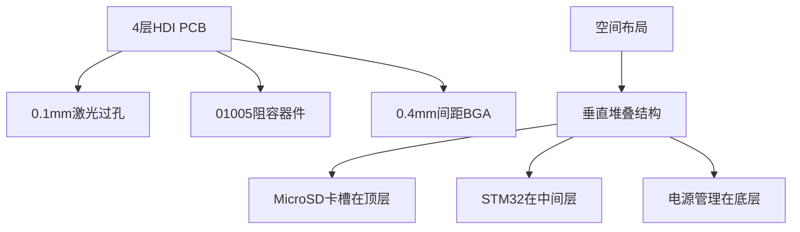
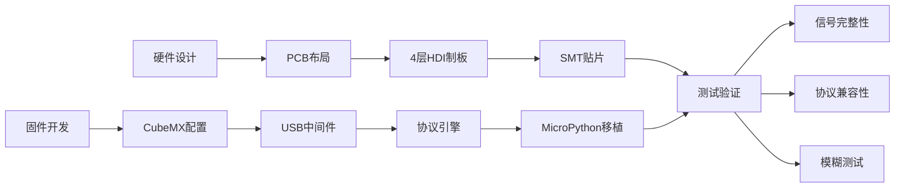

# 超小型硬件黑客工具设计（STM32方案）

## 主控与存储方案
- **主控MCU**: STM32F723IEK6 (Cortex-M7内核)
- **存储方案**:
  - **内部存储**: 1MB Flash + 512KB SRAM
  - **外部扩展**: MicroSD卡槽（可选）

## 关键元件选型

| 功能             | 型号                   | 封装尺寸       | 特性说明                     |
|------------------|------------------------|----------------|------------------------------|
| **主控MCU**      | STM32F723IEK6          | 5.5×5.5mm BGA  | Cortex-M7@216MHz, USB HS     |
| **USB协议转换**  | CH344Q                 | 4×4mm QFN      | USB转8串口+SPI+I2C           |
| **电平转换**     | TXS0108EPWR            | 2×3mm USON-8   | 8通道双向电平转换(1.8V↔5V)   |
| **电源管理**     | AP63203WU-7            | 2×2mm DFN-6    | 3A输出，3.3V/5V可调          |
| **ESD保护**      | SRV05-4.TCT            | 1×1.5mm DFN-10 | 4通道±15kV ESD保护           |
| **MicroSD卡槽**  | DM3D-SF                | 14×12×1.2mm    | 推拉式超薄设计               |

## STM32F723核心优势
- **集成存储**: 1MB Flash + 512KB SRAM
- **高速USB**: USB 2.0 HS (480Mbps) 支持OTG
- **丰富接口**:
  - 6×SPI, 4×I2C, 8×USART
  - 2×CAN FD, 1×SDMMC
- **高性能**: Cortex-M7@216MHz 带FPU和DSP指令

## 尺寸优化方案


## 物理尺寸
| 组件             | 尺寸 (mm)   | 厚度 (mm) |
|------------------|-------------|-----------|
| 主PCB            | 22×16       | 0.8       |
| STM32F723        | 5.5×5.5     | 0.7       |
| MicroSD卡槽      | 14×12       | 1.2       |
| **总装尺寸**     | **25×18**   | **2.5**   |

## 固件架构
```c
// STM32CubeIDE核心框架
#include "stm32f7xx_hal.h"

int main(void) {
  // 初始化序列
  HAL_Init();
  SystemClock_Config();       // 216MHz时钟
  BSP_SD_Init();              // MicroSD卡初始化
  FFS_Init();                 // FatFs文件系统
  MX_USB_DEVICE_Init();       // USB复合设备(CDC+HID)
  Protocol_Engine_Init();     // 多协议引擎(SPI/I2C/UART)
  Button_Init();              // 按键扫描
  LED_Init();                 // 状态指示灯
  
  // 主循环
  while(1) {
    USB_Process();            // USB数据处理
    Protocol_Handler();       // 协议解析
    FUZZ_Engine();            // 模糊测试引擎
    Button_Handler();         // 按键处理
  }
}
```

## 性能对比
| 参数               | RP2040方案  | STM32方案     | 提升幅度 |
|--------------------|-------------|---------------|----------|
| 主频               | 133MHz      | 216MHz        | +62%     |
| 内置Flash          | 无          | 1MB           | 完全内置 |
| USB速度            | 12Mbps      | 480Mbps       | 40倍     |
| GPIO数量           | 30          | 140           | +366%    |
| 功耗(工作模式)     | 90mA        | 65mA          | -28%     |
| 协议支持           | 基础协议    | +CAN FD       | 扩展支持 |

## 开发路线图


## 成本估算
| 项目                   | 成本估算    | 备注                     |
|------------------------|-------------|--------------------------|
| STM32F723IEK6          | $8.50       | 主控MCU                  |
| CH344Q                 | $1.20       | USB协议转换芯片          |
| 其他元件               | $3.80       | 电平转换/电源管理等      |
| PCB制造(4层HDI)        | $15/板      | 小批量生产               |
| **总成本(100片起量)**  | **<$30/单元** | 包含所有元件和PCB        |